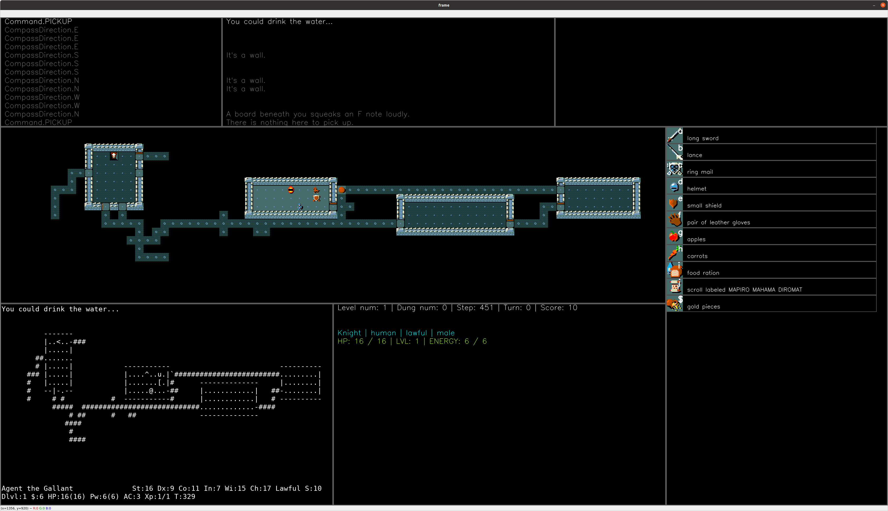

# RPG_RL
Playing the MMORPG using the Deep Reinforcement Learning. The Nethack and Diablo1 game will be used for environment.

# Reference
1. NetHack: https://github.com/facebookresearch/nle
2. NetHack Visualization: https://github.com/maciej-sypetkowski/autoascend
3. Diablo1 for Linux: https://github.com/diasurgical/devilutionX
4. Vizdoom: https://github.com/mwydmuch/ViZDoom
5. Simple SDL2 game: https://github.com/PolyMarsDev/Twini-Golf

# Detailed intruction for code
1. 

# NetHack
Visualization tool is added to original NLE of Facebook code.



You can play a game yourself by below command.

```
$ python3.8 -m nle.scripts.play --env NetHackChallenge-v0
```

# Simple C++ SDL2 game
You can control the SDL2 C++ game using Python.

[](https://www.youtube.com/watch?v=sEmLVRSOaHA)

I set every path as relatively except OpenCV. You need to change the OpenCV_DIR path of [main CMakeLists.txt](https://github.com/kimbring2/RPG_RL/blob/main/Twini-Golf/CMakeLists.txt) to your OpenCV path.

```
set(OpenCV_DIR /home/kimbring2/opencv/build)
find_package( OpenCV REQUIRED )
include_directories( ${OpenCV_INCLUDE_DIRS} )
```

Then, move to [Twini-Golf folder](https://github.com/kimbring2/RPG_RL/tree/main/Twini-Golf) and build project using below command.

```
$ cmake .
$ make
```

You should check there is 'vizgolf.cpython-38-x86_64-linux-gnu.so' under [lib_python folder](https://github.com/kimbring2/RPG_RL/tree/main/Twini-Golf/src/lib_python) folder. Next, copy the [twingolf](https://github.com/kimbring2/RPG_RL/blob/main/Twini-Golf/src/vizgolf/twingolf) file to the lib_python folder.

Then, move to [lib_python folder](https://github.com/kimbring2/RPG_RL/tree/main/Twini-Golf/src/lib_python).

Open Jupyter Notebook for 'env_test.ipynb' and test code of video.
